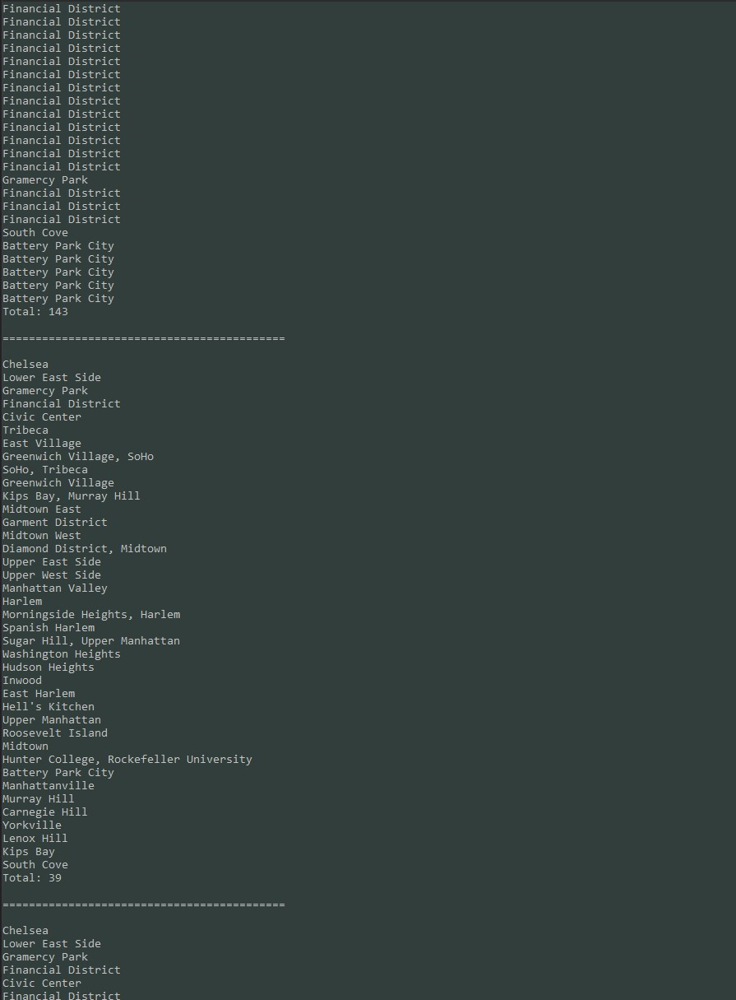

# LINQ-in-Manhattan

Lab09

*Author: Andrew Smith*

---

### Description

This is a console applications that demonstrates the capabilities of LINQ. Given JSON data
in an external file in the root of the project names 'data.json', the application outputs  
different queries to the console.

1. Query 1: Outputs all neighborhoods (147 total)
2. Query 2: Outputs all neighborhoods exuding empty neighborhoods (143 total)
3. Query 3: Outputs all unique neighborhoods excluding empty neighborhoods (39)
4. Query 4: Combine all the above queries into one 
5. Query 5: Use a method LINQ for query 1.

---

### Getting Started

Clone this repository to your local machine.

`$ git clone https://github.com/AndrewCS149/Lab09-LINQ-in-Manhattan.git`

### To run this program from the windows command line

From the project root, run:

1. `$ cd .\LINQInManhattan\LINQInManhattan\bin\Debug\netcoreapp3.1\`
2. `$ dotnet .\LINQInManhattan.dll`
---

### To run this program from the File Explorer

From the project root, navigate to:

`\LINQInManhattan\LINQInManhattan\bin\Debug\netcoreapp3.1\`

Then open:

`LINQInManhattan.exe`

---

### Visuals

Console Output:

---

### Change Log
- 1.4 Change absolute path to relative path - 18 July 2020
- 1.3 Application Complete - 16 July 2020
- 1.2 PrintQuery() - 16 July 2020
- 1.1 GenerateGeometry() - 16 July 2020
- 1.0 GenerateProps() - 16 July 2020

